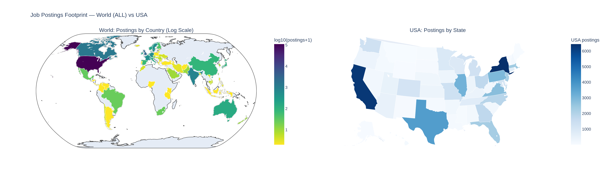
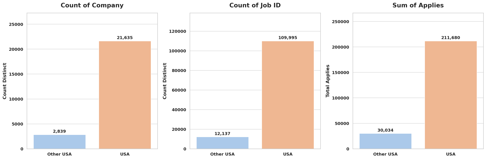
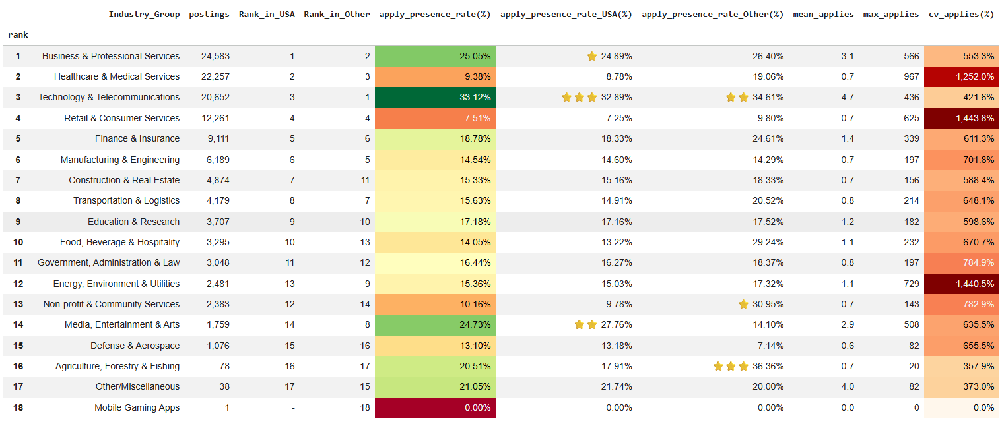
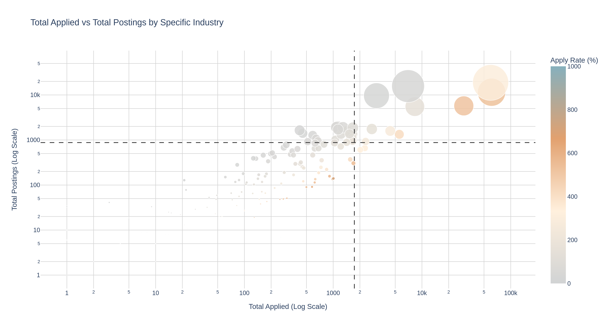
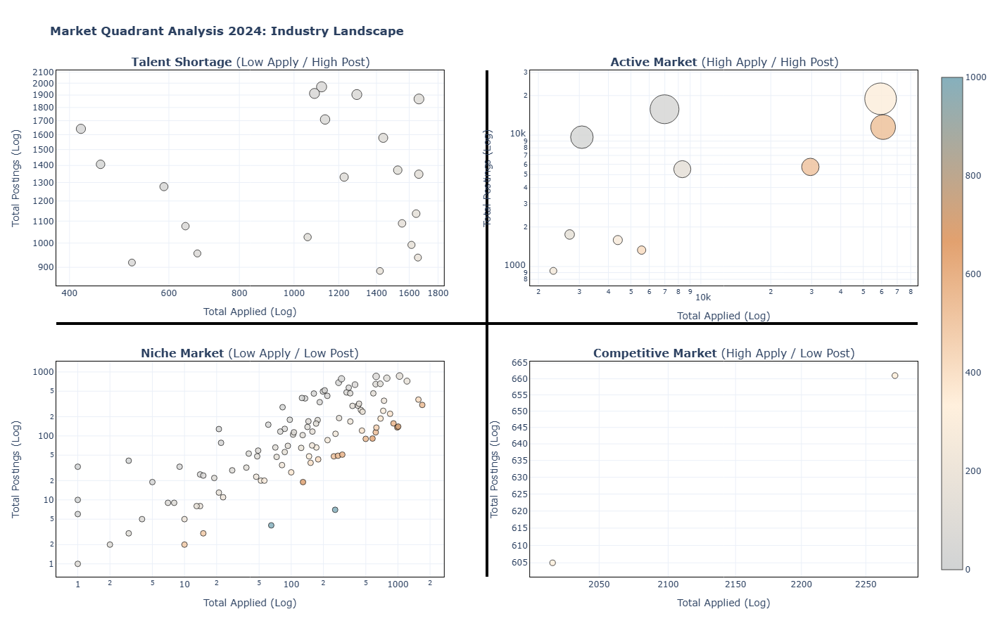
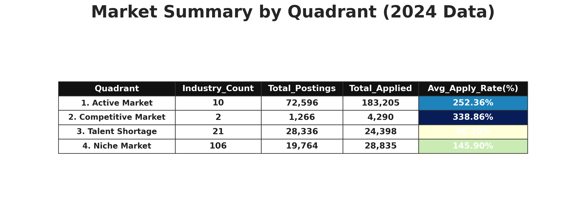

# Dataset / Data Source

LinkedIn Job Postings (2023 - 2024): https://www.kaggle.com/datasets/arshkon/linkedin-job-postings

---

# LinkedIn Job Postings Analysis (2024) — USA Focus

โปรเจกต์นี้วิเคราะห์ข้อมูลประกาศงานจาก LinkedIn (ช่วงปี 2023–2024) เพื่อวิเคราะห์ภาพรวมตลาดงานและพฤติกรรมการสมัครงานผ่านโพสต์ประกาศงานบน LinkedIn โดยโฟกัสการเจาะลึกปี 2024 และตลาดงานในสหรัฐฯ (USA) ก่อน จากนั้นจึงเปรียบเทียบกับกลุ่มประเทศอื่น (Other vs USA) เพื่อทำความเข้าใจ ขนาดตลาดงาน และ พฤติกรรมการสมัครงาน จากข้อมูลที่มี ทั้งฝั่ง supply และฝั่ง demand

---

## Why LinkedIn?
เราเลือก LinkedIn เพราะเป็นแพลตฟอร์มที่สะท้อน ตลาดแรงงานจริง ได้ดี ทั้งในมุมของความต้องการจ้างงาน (job postings) และความสนใจของผู้สมัคร (views/applies เมื่อมีข้อมูล)  
อีกทั้งยังมีมิติที่เหมาะกับการวิเคราะห์เชิงธุรกิจและเชิงพื้นที่ เช่น ประเทศ/รัฐ, รูปแบบการทำงาน (remote/hybrid/on-site) ทำให้เล่าเรื่องได้ตั้งแต่ภาพใหญ่ของตลาด ไปจนถึง เจาะลึกพฤติกรรมในพื้นที่เป้าหมาย

---

# Job Postings — World(ALL) vs USA
ภาพรวมการกระจายตัวของประกาศงาน (job postings) จากข้อมูล LinkedIn โดยประเทศไหนเป็นตลาดหลักของการโพสต์งาน และภายในสหรัฐฯ มีรัฐใดเป็นศูนย์กลางของการประกาศงานมากที่สุด ในเชิงภูมิศาสตร์

- แผนที่ฝั่งซ้าย (World): แสดงจำนวนประกาศงานแยกตามประเทศ ภาพนี้ใช้สเกล log10(postings + 1) เพราะในบางประเทศ โดยเฉพาะสหรัฐฯ มีจำนวนประกาศงานสูงกว่าประเทศอื่น หากใช้สเกลปกติ ประเทศส่วนใหญ่จะมีสีอ่อนจนมองความแตกต่างไม่ออก การใช้ log scale จึงช่วยให้เราเห็นทั้งประเทศที่มีประกาศงาน “สูง” และประเทศระดับ “กลาง–ต่ำ” ได้อยู่ในภาพเดียวกันอย่างชัดเจน คือ สีในแผนที่ไม่ได้แค่บอกว่า มากหรือน้อย แต่ช่วยให้เข้าใจในข้อมูลของขนาดตลาด ระหว่างประเทศต่าง ๆ
- แผนที่ฝั่งขวา (USA): โฟกัสเข้าเฉพาะสหรัฐฯ (USA) และแสดงจำนวนประกาศงานแยกตามรัฐ จุดประสงค์คือดูว่า ภายในประเทศที่เป็นตลาดใหญ่ในข้อมูลอย่าง USA งานกระจุกตัวอยู่ตรงไหน จากภาพจะเห็นว่าบางรัฐมีสีเข้มกว่าชัดเจน สื่อว่ามีจำนวนประกาศงานสูงกว่ารัฐอื่น ๆ อย่างมีนัยสำคัญ ซึ่งช่วยปูทางให้การวิเคราะห์ขั้นถัดไป (เช่น การเปรียบเทียบ remote/non-remote หรือพฤติกรรมการสมัคร) สามารถตีความได้ดีขึ้น เพราะตลาดงานของ USA ไม่ได้กระจายเท่ากันทุกพื้นที่ แต่มี “ศูนย์กลาง” ที่โดดเด่น

## Tables Top 10
เพื่อเพิ่มความชัดเจนในการอ่านและตีความข้อมูลจากแผนที่ จึงจัดทำตาราง Top 10 ไว้ด้านล่าง เพื่อแสดงลำดับและค่าตัวเลขเชิงปริมาณที่สอดคล้องกับรูปแบบการกระจายตัวที่ปรากฏบนแผนที่
- ตารางซ้าย (Top 10 Countries): แสดง 10 ประเทศที่มีประกาศงานเยอะที่สุด ซึ่งช่วยยืนยันว่าข้อมูลชุดนี้มี ไปทางประเทศ USA อย่างโดดเด่น และเป็นเหตุผลสำคัญของการเลือกโฟกัสการวิเคราะห์ใน USA
- ตารางขวา (Top 10 USA States): แสดง 10 รัฐที่มีการประกาศงานมากที่สุดในสหรัฐฯ ทำให้เห็นว่า รัฐที่เป็นศูนย์กลางตลาดงาน มีรัฐใดบ้าง และช่วยยืนยันว่าพื้นที่สีเข้มในแผนที่ USA แปลเป็นจำนวนประกาศงานที่สูงจริง

---

# USA vs Other USA — Summary Metrics
เพื่อให้เห็นภาพความแตกต่างของ ขนาดตลาดงาน และ ความสนใจของผู้สมัคร ในชุดข้อมูลนี้ จึงได้ทำการเปรียบเทียบข้อมูลออกเป็น 2 กลุ่มหลัก ได้แก่ USA และ Other USA (ประเทศอื่นทั้งหมดที่ไม่ใช่ USA) โดยสรุปผลผ่าน 3 ตัวหลัก ได้แก่ จำนวนบริษัทที่ไม่ซ้ำ, จำนวนประกาศงานที่ไม่ซ้ำ และจำนวนการสมัครรวม (applies)

1) Count of Company (distinct): สะท้อน ความหลากหลายของผู้จ้างงาน พบว่ากลุ่ม USA มีบริษัทที่ลงประกาศงานจำนวนมาก (21,635 บริษัท) เมื่อเทียบกับกลุ่ม Other USA (2,839 บริษัท) แปลได้ว่าใน dataset นี้มีฐานผู้จ้างงานใน USA เป็นส่วนมาก
2) Count of Job ID (distinct): แทน จำนวนประกาศงานจริง หรือมุมของ ปริมาณตำแหน่งงานที่ถูกโพสต์ (supply) พบว่ากลุ่ม USA มีจำนวนประกาศงาน (109,995 โพสต์) ขณะที่กลุ่ม Other USA มีเพียง (12,137 โพสต์) ผลลัพธ์นี้ช่วยยืนยันว่า ข้อมูล ขนาดตลาดงานใน dataset ชุดนี้กระจุกตัวที่ USA เป็น ซึ่งส่วนมาก ซึ่งเป็นเหตุผลสำคัญที่โฟกัสการวิเคราะห์เชิงลึกใน USA ต่อไป
3) Sum of Applies: เป็นเชิงพฤติกรรม (engagement) ของผู้สมัครต่อประกาศงาน จากกราฟพบว่ากลุ่ม USA มีจำนวนการสมัครรวมสูง (211,680 ครั้ง) เมื่อเทียบกับกลุ่ม Other USA (30,034 ครั้ง) สะท้อนว่าในข้อมูลชุดนี้ USA มีประกาศงานและ การตอบสนองของผู้สมัครที่มากกว่า

สรุป: กราฟนี้จึงช่วยตอบคำถามว่า “ตลาดงานฝั่ง USA นั้นมีขนาดที่เยอะกว่ากลุ่มประเทศอื่นมากแค่ไหน” ของ dataset นี้ ทั้งในมิติ จำนวนผู้จ้างงาน, จำนวนประกาศงาน, และ การสมัคร ดังนั้นในขั้นตอนถัดไป จึงเลือกเจาะลึกการวิเคราะห์ภายใน USA (โดยเฉพาะปี 2024)

---

# Industry Screening — Postings vs Applicant Interest (Apply Presence)

ตารางนี้ใช้เพื่อ ดู 2 มุมพร้อมกัน คือ
ฝั่งผู้จ้าง: dataset ชุดนี้มีความต้องการสูงใน 3 กลุ่มอย่างชัดเจน โดยประเทศ USA และ Other นั้นจะมีการประกาศงานในอุตสาหกรรมที่เหมือนกัน คือ
- Business & Professional Services
- Healthcare & Medical Services
- Technology & Telecommunications

ฝั่งผู้สมัคร: งานในอุตสาหกรรมนั้นๆ มีการสมัคร มากน้อยเพียงใด จะเห็นว่าอุตสาหกรรมที่ได้สัญญาณความสนใจโดดเด่น

USA
- Technology & Telecommunications ~32.89%
- Media, Entertainment & Arts ~27.76%
- Business & Professional Services ~24.89%

Other
- Agriculture, Forestry & Fishing ~36.36%
- Technology & Telecommunications ~34.61%
- Non-profit & Community Services ~30.95%

ทำให้เห็นความต่างว่า อุตสาหกรรมที่โพสต์เยอะ ไม่จำเป็นต้องเป็นอุตสาหกรรมที่มีการสมัครสูงที่สุดเสมอไป

---

#Market Quadrant Analysis (2024) — Applied vs Postings by Specific Industry

วิเคราะห์ ตลาดแรงงาน ในระดับ Specific Industry (อุตสาหกรรมย่อย) โดยใช้ 2 ตัวแปรหลักในการมองภาพร่วมกัน ได้แก่
- Total Postings: จำนวนประกาศงานรวม
- Total Applied: จำนวนการสมัครรวม

จึงทำการวิเคราะห์แบ่งกลุ่มตลาดออก เป็น 4 Quadrant เพื่อให้เข้าใจได้ง่ายว่าแต่ละอุตสาหกรรมย่อยอยู่ในสภาพตลาดแบบใด เช่น ตลาดคึกคัก ตลาดแข่งขันสูง หรือกลุ่มที่เหมือนกำลังขาดแคลนแรงงาน

##Insight ที่ได้จากการ Cross ของ Apply และ Post

โดยแบ่ง Quadrant โดยเห็นชัดขึ้นว่า อุตสาหกรรม/บริษัทในกลุ่มนั้นมีพฤติกรรมตลาดแบบใด
1.High Apply / High Post (Active Market): มักพบในบริษัทขนาดใหญ่ เพราะมีทั้งจำนวนโพสต์สูงและจำนวนผู้สมัครสูงพร้อมกัน มักพบในบริษัทขนาดใหญ่หรือองค์กรที่มีการจ้างงานต่อเนื่อง (เช่น Amazon, Microsoft หรือกลุ่มธนาคาร)
2.High Apply / Low Post (Competitive Market): มักเกี่ยวข้องกับบริษัทที่ได้รับความนิยมสูง เพราะตำแหน่งเปิดไม่ได้มาก แต่มีผู้สมัครจำนวนมากไหลเข้ามา เช่น FAANG (Netflix, Apple) หรือ Start-up ที่รายได้ดี
3.Low Apply / High Post (Talent Shortage): โพสต์งานจำนวนมากแต่คนสมัครน้อย อาจพบในกลุ่มบริษัทจัดหางาน/ตัวกลาง (เช่น CyberCoders, Robert Half, Atc)
4.Low Apply / Low Post (Niche Market): มักเป็นธุรกิจ B2B ขนาดกลาง ทั้งโพสต์และผู้สมัครมีไม่มาก ซึ่งเป็นธุรกิจเฉพาะทาง หรือ Local Business ที่อาจไม่ได้ทำ PR มากเท่ากลุ่มอื่น

---
---
###ด้านล่างนี้ คือ ข้อความเก่า
# DADS5001 Mini Project — LinkedIn Job Postings (2024)

## Project Topic
การวิเคราะห์แนวโน้มตลาดงานบน LinkedIn (ปี 2024): รูปแบบงาน Remote, ระดับเงินเดือนมาตรฐาน (Normalized Salary) และทักษะที่เป็นที่ต้องการ  

## Research Questions (Story)
**5.1 ภาพรวม**
- ช่วงปี 2024 จำนวนประกาศงานบน LinkedIn มีความเคลื่อนไหวมากน้อยแค่ไหน (จำนวนงาน/จำนวนบริษัท)
- ระดับความสนใจของผู้สมัครโดยรวมผ่านการ ดู และ สมัคร

**5.2 มุมมองตลาดตามพื้นที่ สหรัฐฯ vs ประเทศอื่น**
- แบ่งประกาศงานออกเป็น 2 กลุ่มใหญ่ เพื่อดูความแตกต่างของตลาดงานในสหรัฐฯ เทียบกับประเทศอื่น
- เปรียบเทียบว่า คนสนใจ และ สมัคร งานพื้นที่ไหนมากกว่า

**5.3 อุตสาหกรรมไหน คนดูเยอะ/สมัครเยอะ**
- อันดับอุตสาหกรรมที่ได้รับความสนใจสูงที่สุดในปี 2024
- เปรียบเทียบ Top อุตสาหกรรมของ สหรัฐฯ vs ประเทศอื่น เพื่อให้เห็นภาพต่างกันชัดเจน

**5.4 แนวโน้มงาน Remote ตามเวลา (รายเดือน/ไตรมาส)**
- ช่วงไหนงาน Remote พีค/ดรอป

**5.5 เปรียบเทียบรายได้ Remote vs ไม่ Remote**
- เปรียบเทียบระดับเงินเดือนของงานที่ทำงานทางไกลกับงานที่ต้องเข้าออฟฟิศ

**5.6 ทักษะที่ตลาดต้องการ และทักษะที่ พาเงินเดือนสูง**
- ทักษะยอดนิยม ที่พบในประกาศงานมากที่สุด
- วิเคราะห์ว่า ทักษะไหนสัมพันธ์กับเงินเดือนสูง และโดยเฉพาะในงาน Remote ทักษะไหนช่วยดันเงินเดือนได้มาก

---

## Dataset Source
- Kaggle: LinkedIn Job Postings (2023–2024)  
  https://www.kaggle.com/datasets/arshkon/linkedin-job-postings
