# Dataset / Data Source

LinkedIn Job Postings (2023 - 2024): https://www.kaggle.com/datasets/arshkon/linkedin-job-postings

---

# LinkedIn Job Postings Analysis (2024) — USA Focus

โปรเจกต์นี้วิเคราะห์ข้อมูลประกาศงานจาก LinkedIn (ช่วงปี 2023–2024) เพื่อวิเคราะห์ภาพรวมตลาดงานและพฤติกรรมการสมัครงานผ่านโพสต์ประกาศงานบน LinkedIn โดยโฟกัสการเจาะลึกปี 2024 และตลาดงานในสหรัฐฯ (USA) ก่อน จากนั้นจึงเปรียบเทียบกับกลุ่มประเทศอื่น (Other vs USA) เพื่อทำความเข้าใจ ขนาดตลาดงาน และ พฤติกรรมการสมัครงาน จากข้อมูลที่มี ทั้งฝั่ง supply และฝั่ง demand

---

## Why LinkedIn?
เราเลือก LinkedIn เพราะเป็นแพลตฟอร์มที่สะท้อน ตลาดแรงงานจริง ได้ดี ทั้งในมุมของความต้องการจ้างงาน (job postings) และความสนใจของผู้สมัคร (views/applies เมื่อมีข้อมูล)  
อีกทั้งยังมีมิติที่เหมาะกับการวิเคราะห์เชิงธุรกิจและเชิงพื้นที่ เช่น ประเทศ/รัฐ, รูปแบบการทำงาน (remote/hybrid/on-site) ทำให้เล่าเรื่องได้ตั้งแต่ภาพใหญ่ของตลาด ไปจนถึง เจาะลึกพฤติกรรมในพื้นที่เป้าหมาย

---

# Job Postings — World(ALL) vs USA
ภาพรวมการกระจายตัวของประกาศงาน (job postings) จากข้อมูล LinkedIn โดยประเทศไหนเป็นตลาดหลักของการโพสต์งาน และภายในสหรัฐฯ มีรัฐใดเป็นศูนย์กลางของการประกาศงานมากที่สุด ในเชิงภูมิศาสตร์

- แผนที่ฝั่งซ้าย (World): แสดงจำนวนประกาศงานแยกตามประเทศ ภาพนี้ใช้สเกล log10(postings + 1) เพราะในบางประเทศ โดยเฉพาะสหรัฐฯ มีจำนวนประกาศงานสูงกว่าประเทศอื่น หากใช้สเกลปกติ ประเทศส่วนใหญ่จะมีสีอ่อนจนมองความแตกต่างไม่ออก การใช้ log scale จึงช่วยให้เราเห็นทั้งประเทศที่มีประกาศงาน “สูง” และประเทศระดับ “กลาง–ต่ำ” ได้อยู่ในภาพเดียวกันอย่างชัดเจน คือ สีในแผนที่ไม่ได้แค่บอกว่า มากหรือน้อย แต่ช่วยให้เข้าใจในข้อมูลของขนาดตลาด ระหว่างประเทศต่าง ๆ
- แผนที่ฝั่งขวา (USA): โฟกัสเข้าเฉพาะสหรัฐฯ (USA) และแสดงจำนวนประกาศงานแยกตามรัฐ จุดประสงค์คือดูว่า ภายในประเทศที่เป็นตลาดใหญ่ในข้อมูลอย่าง USA งานกระจุกตัวอยู่ตรงไหน จากภาพจะเห็นว่าบางรัฐมีสีเข้มกว่าชัดเจน สื่อว่ามีจำนวนประกาศงานสูงกว่ารัฐอื่น ๆ อย่างมีนัยสำคัญ ซึ่งช่วยปูทางให้การวิเคราะห์ขั้นถัดไป (เช่น การเปรียบเทียบ remote/non-remote หรือพฤติกรรมการสมัคร) สามารถตีความได้ดีขึ้น เพราะตลาดงานของ USA ไม่ได้กระจายเท่ากันทุกพื้นที่ แต่มี “ศูนย์กลาง” ที่โดดเด่น

### Tables Top 10
เพื่อเพิ่มความชัดเจนในการอ่านและตีความข้อมูลจากแผนที่ จึงจัดทำตาราง Top 10 ไว้ด้านล่าง เพื่อแสดงลำดับและค่าตัวเลขเชิงปริมาณที่สอดคล้องกับรูปแบบการกระจายตัวที่ปรากฏบนแผนที่
- ตารางซ้าย (Top 10 Countries): แสดง 10 ประเทศที่มีประกาศงานเยอะที่สุด ซึ่งช่วยยืนยันว่าข้อมูลชุดนี้มี ไปทางประเทศ USA อย่างโดดเด่น และเป็นเหตุผลสำคัญของการเลือกโฟกัสการวิเคราะห์ใน USA
- ตารางขวา (Top 10 USA States): แสดง 10 รัฐที่มีการประกาศงานมากที่สุดในสหรัฐฯ ทำให้เห็นว่า รัฐที่เป็นศูนย์กลางตลาดงาน มีรัฐใดบ้าง และช่วยยืนยันว่าพื้นที่สีเข้มในแผนที่ USA แปลเป็นจำนวนประกาศงานที่สูงจริง

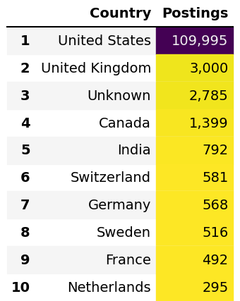
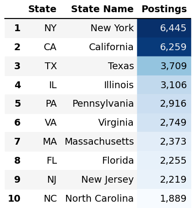

---

# USA vs Other USA — Summary Metrics
เพื่อให้เห็นภาพความแตกต่างของ ขนาดตลาดงาน และ ความสนใจของผู้สมัคร ในชุดข้อมูลนี้ จึงได้ทำการเปรียบเทียบข้อมูลออกเป็น 2 กลุ่มหลัก ได้แก่ USA และ Other USA (ประเทศอื่นทั้งหมดที่ไม่ใช่ USA) โดยสรุปผลผ่าน 3 ตัวหลัก ได้แก่ จำนวนบริษัทที่ไม่ซ้ำ, จำนวนประกาศงานที่ไม่ซ้ำ และจำนวนการสมัครรวม (applies)

1) Count of Company (distinct): สะท้อน ความหลากหลายของผู้จ้างงาน พบว่ากลุ่ม USA มีบริษัทที่ลงประกาศงานจำนวนมาก (21,635 บริษัท) เมื่อเทียบกับกลุ่ม Other USA (2,839 บริษัท) แปลได้ว่าใน dataset นี้มีฐานผู้จ้างงานใน USA เป็นส่วนมาก
2) Count of Job ID (distinct): แทน จำนวนประกาศงานจริง หรือมุมของ ปริมาณตำแหน่งงานที่ถูกโพสต์ (supply) พบว่ากลุ่ม USA มีจำนวนประกาศงาน (109,995 โพสต์) ขณะที่กลุ่ม Other USA มีเพียง (12,137 โพสต์) ผลลัพธ์นี้ช่วยยืนยันว่า ข้อมูล ขนาดตลาดงานใน dataset ชุดนี้กระจุกตัวที่ USA เป็น ซึ่งส่วนมาก ซึ่งเป็นเหตุผลสำคัญที่โฟกัสการวิเคราะห์เชิงลึกใน USA ต่อไป
3) Sum of Applies: เป็นเชิงพฤติกรรม (engagement) ของผู้สมัครต่อประกาศงาน จากกราฟพบว่ากลุ่ม USA มีจำนวนการสมัครรวมสูง (211,680 ครั้ง) เมื่อเทียบกับกลุ่ม Other USA (30,034 ครั้ง) สะท้อนว่าในข้อมูลชุดนี้ USA มีประกาศงานและ การตอบสนองของผู้สมัครที่มากกว่า

สรุป: กราฟนี้จึงช่วยตอบคำถามว่า “ตลาดงานฝั่ง USA นั้นมีขนาดที่เยอะกว่ากลุ่มประเทศอื่นมากแค่ไหน” ของ dataset นี้ ทั้งในมิติ จำนวนผู้จ้างงาน, จำนวนประกาศงาน, และ การสมัคร ดังนั้นในขั้นตอนถัดไป จึงเลือกเจาะลึกการวิเคราะห์ภายใน USA (โดยเฉพาะปี 2024)

---

# Industry Screening — Postings vs Applicant Interest (Apply Presence)

ตารางนี้ใช้เพื่อ ดู 2 มุมพร้อมกัน คือ
ฝั่งผู้จ้าง: dataset ชุดนี้มีความต้องการสูงใน 3 กลุ่มอย่างชัดเจน โดยประเทศ USA และ Other นั้นจะมีการประกาศงานในอุตสาหกรรมที่เหมือนกัน คือ
- Business & Professional Services
- Healthcare & Medical Services
- Technology & Telecommunications

ฝั่งผู้สมัคร: งานในอุตสาหกรรมนั้นๆ มีการสมัคร มากน้อยเพียงใด จะเห็นว่าอุตสาหกรรมที่ได้สัญญาณความสนใจโดดเด่น

USA
- Technology & Telecommunications ~32.89%
- Media, Entertainment & Arts ~27.76%
- Business & Professional Services ~24.89%

Other
- Agriculture, Forestry & Fishing ~36.36%
- Technology & Telecommunications ~34.61%
- Non-profit & Community Services ~30.95%

ตารางทำให้เห็นความต่างว่า อุตสาหกรรมที่โพสต์เยอะ ไม่จำเป็นต้องเป็นอุตสาหกรรมที่มีการสมัครสูงที่สุดเสมอไป

---

# Market Quadrant Analysis (2024) — Applied vs Postings by Specific Industry

วิเคราะห์ ตลาดแรงงาน ในระดับ Specific Industry (อุตสาหกรรมย่อย) โดยใช้ 2 ตัวแปรหลักในการมองภาพร่วมกัน ได้แก่
- Total Postings: จำนวนประกาศงานรวม
- Total Applied: จำนวนการสมัครรวม

จึงทำการวิเคราะห์แบ่งกลุ่มตลาดออก เป็น 4 Quadrant เพื่อให้เข้าใจได้ง่ายว่าแต่ละอุตสาหกรรมย่อยอยู่ในสภาพตลาดแบบใด เช่น ตลาดคึกคัก ตลาดแข่งขันสูง หรือกลุ่มที่เหมือนกำลังขาดแคลนแรงงาน

### Insight ที่ได้จากการ Cross ของ Apply และ Post

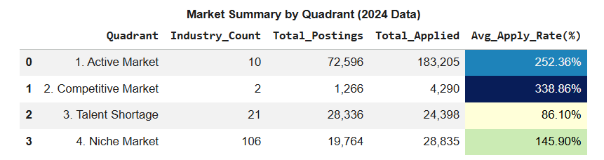

โดยแบ่ง 4 Quadrant โดยเห็นชัดขึ้นว่า อุตสาหกรรม/บริษัทในกลุ่มนั้นมีพฤติกรรมตลาดแบบใด
1) High Apply / High Post (Active Market): มักพบในบริษัทขนาดใหญ่ เพราะมีทั้งจำนวนโพสต์สูงและจำนวนผู้สมัครสูงพร้อมกัน มักพบในบริษัทขนาดใหญ่หรือองค์กรที่มีการจ้างงานต่อเนื่อง (เช่น Amazon, Microsoft หรือกลุ่มธนาคาร)
2) High Apply / Low Post (Competitive Market): มักเกี่ยวข้องกับบริษัทที่ได้รับความนิยมสูง เพราะตำแหน่งเปิดไม่ได้มาก แต่มีผู้สมัครจำนวนมากไหลเข้ามา เช่น FAANG (Netflix, Apple) หรือ Start-up ที่รายได้ดี
3) Low Apply / High Post (Talent Shortage): โพสต์งานจำนวนมากแต่คนสมัครน้อย อาจพบในกลุ่มบริษัทจัดหางาน/ตัวกลาง (เช่น CyberCoders, Robert Half, Atc)
4) Low Apply / Low Post (Niche Market): มักเป็นธุรกิจ B2B ขนาดกลาง ทั้งโพสต์และผู้สมัครมีไม่มาก ซึ่งเป็นธุรกิจเฉพาะทาง หรือ Local Business ที่อาจไม่ได้ทำ PR มากเท่ากลุ่มอื่น

### Top Companies by Specific Industry & Quadrant: Application Success Rate

ต่อยอดจากการวิเคราะห์แบบ Quadrant ในระดับอุตสาหกรรมย่อย โดยลงลึกมาที่ระดับบริษัท เพื่อดูว่าบริษัทใดเป็นตัวแทนสำคัญของแต่ละ Quadrant และเมื่อเทียบกับจำนวนโพสต์ทั้งหมดของบริษัทนั้นแล้ว บริษัทใดมี Application Success Rate สูงหรือต่ำกว่ากัน

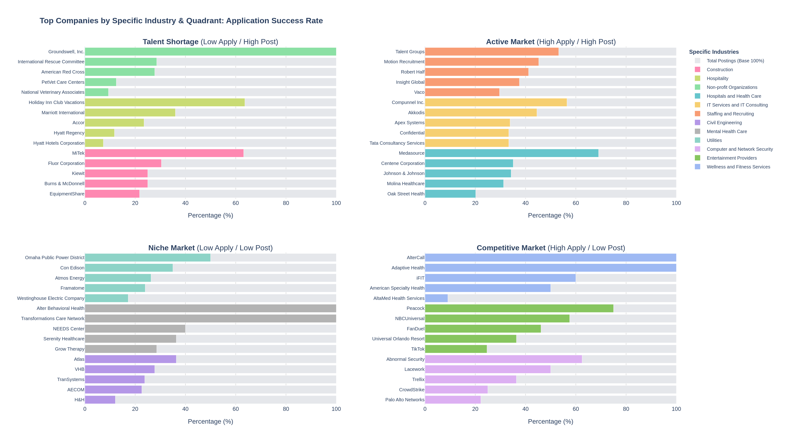

แถบสีเทา-กำหนดให้เป็น ฐานของจำนวนโพสต์ทั้งหมด 100%

แถบสีจริง-แสดงสัดส่วนของโพสต์ที่สามารถสร้างการตอบสนองจากผู้สมัครได้

จากข้อมูลในแต่ละอุตสาหกรรม ได้ทำการคัดเลือกบริษัท 5 อันดับแรกที่สะท้อนความสัมพันธ์ระหว่างจำนวนการสมัครและจำนวนประกาศงาน เพื่อใช้เป็นตัวแทน 5 อันดับแรก ของระดับการแข่งขันในตลาดแรงงานแต่ละกลุ่มตามการแบ่ง 4 Quadrants และเพื่อแสดงให้เห็นถึงความสามารถของบริษัทในการดึงดูดความสนใจจากผู้สมัครในแต่ละตลาด

---

# Market Overview: Salary & Freedom (USA vs Other)

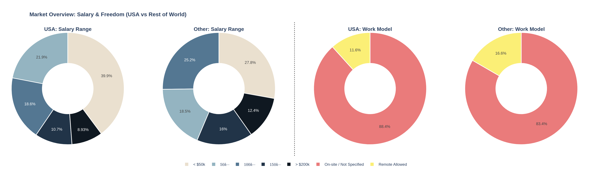

1) โครงสร้างช่วงเงินเดือน (Salary Range)
    - USA: มีกระจุกตัว อยู่ในช่วงเงินเดือนหลักค่อนข้างชัด โดยสัดส่วนมากที่สุดอยู่ที่ <$50k (39.9%), $50k- (21.9%) และ $100k- (18.6%) สะท้อนว่าประกาศงานส่วนใหญ่ใน dataset นี้อยู่ในช่วงรายได้ระดับกลางถึงค่อนข้างสูง
    - Other: มีการกระจายตัว ของช่วงเงินเดือนกว้างกว่า โดยสัดส่วนแต่ละช่วงใกล้เคียงกันมากขึ้น เช่น <$50k (27.8%), $100k- (25.2%), และ $50k- (18.5%) แสดงให้เห็นว่าตลาดนอก USA มีความหลากหลายของโครงสร้างเงินเดือนมากกว่า USA

2) รูปแบบการทำงาน (Work Model)
   - USA: ส่วนใหญ่ยังอยู่ในกลุ่ม On-site / Not Specified ถึง 88.4% ขณะที่งานแบบ Remote Allowed มีเพียง 11.6% สะท้อนว่ารูปแบบการทำงานที่ยืดหยุ่นยังไม่ใช่สัดส่วนหลักของตลาดในข้อมูลชุดนี้
   - Other: สัดส่วนหลักอยู่ในกลุ่ม On-site / Not Specified เช่นกันที่ 83.4% แต่มีงานแบบ Remote Allowed สูงกว่า USA เล็กน้อยที่ 16.6% แสดงให้เห็นว่าตลาดนอก USA มีความยืดหยุ่นด้านรูปแบบการทำงานมากกว่าเล็กน้อย

### Salary Range by Quadrant (USA vs Non-USA)

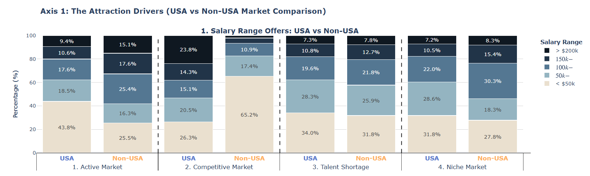

  1) Active Market
       - USA: สะท้อนว่าตลาด Active ของ USA ยังมีฐานใหญ่เป็นงานช่วงเงินเดือนล่างถึงกลาง
       - Non-USA: ตลาดใน Non-USA ไม่ได้พึ่งพาแค่ช่วงเงินเดือนล่าง แต่มีสัดส่วนของงานเงินเดือนกลางและสูงมากขึ้น
  2) Competitive Market
       - USA: ตลาดมีทั้งงานระดับฐานและงานรายได้สูง สะท้อนการแข่งขันที่เกิดขึ้นในตำแหน่งที่องค์กรพร้อมจ่ายสูงเพื่อดึงดูดคนที่มีคุณภาพ
       - Non-USA: สะท้อนว่านอก USA ส่วนใหญ่ยังเกิดงานช่วงเงินเดือนล่างเป็นหลัก เน้นงานช่วงเงินเดือนล่างเป็นหลัก แต่ชดเชยด้วย benefit และความยืดหยุ่นในการทำงาน เช่น remote ที่มีสัดส่วนสูงกว่า
  3) Talent Shortage
       - USA: เงินเดือนส่วนใหญ่กระจุกอยู่ที่ <$50k, $50k–
       - Non-USA: มีรูปแบบใกล้เคียงกันกับ USA
  4) Niche Market
       - USA: เงินเดือนกระจุกอยู่ที่ <$50k, $50k
       - Non-USA: โครงสร้างต่างออกไปเล็กน้อย โดยกลุ่มที่มากที่สุดคือ $100k, <$50k

### Work Model Availability by Quadrant (USA vs Non-USA)

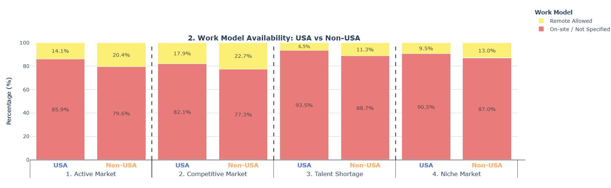

  1) Active Market: ทั้งสองฝั่งยังเป็น On-site / Not Specified เป็นหลัก แต่ Non-USA อาจใช้ ความยืดหยุ่นในการทำงาน เป็นแรงจูงใจเสริมมากกว่า USA
  2) Competitive Market: ตลาดนี้มีสัดส่วน Remote สูงกว่ากลุ่มอื่น จึงอาจตีความได้ว่า งานที่มีการแข่งขันสูง มักมาพร้อมความยืดหยุ่นมากขึ้น และ Remote อาจเป็นหนึ่งในปัจจัยที่ช่วยดึงดูดผู้สมัครเข้าสู่ตลาดนี้
  3) Talent Shortage: กลุ่มนี้มีสัดส่วน Remote ต่ำที่สุดในทุกตลาด อาจยิ่งทำให้ฐานผู้สมัครแคบลง และเป็นหนึ่งในเหตุผลที่ทำให้ โพสต์เยอะ แต่สมัครน้อย
  4) Niche Market: ทั้งสองฝั่งยังคงเป็น On-site / Not Specified เป็นหลัก แสดงว่าตลาดเฉพาะทางยังไม่ได้ขับเคลื่อนด้วย Work Flexibility มากนัก โดยแรงดึงดูดของตลาดอาจมาจาก ความเฉพาะของงาน มากกว่ารูปแบบการทำงาน

---

# Company Size Dynamics in the Job Market

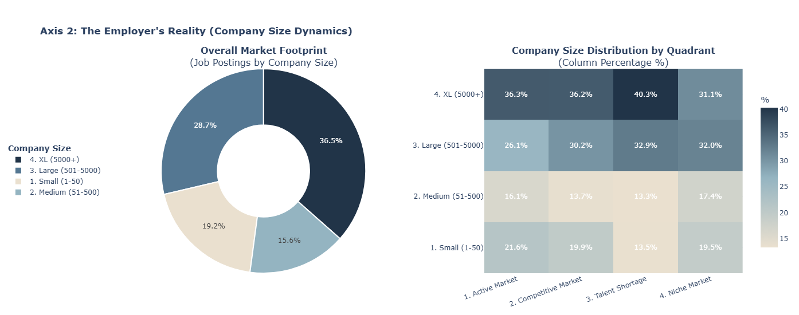

- Overall Market Footprint: ภาพรวมของตลาดถูกขับเคลื่อนโดย บริษัทขนาดใหญ่เป็นหลัก หากรวมขนาดกลุ่ม Large + XL นั้นมีมีสัดส่วนมากกว่า 65% ของทั้งหมด ซึ่งมีการประกาศงานจำนวนมากในระบบ
- Company Size Distribution by Quadrant: โครงสร้างขนาดบริษัททั้ง 4 กลุ่มตลาด พบว่า "Active Market" และ "Competitive Market" ยังคงถูกขับเคลื่อนโดยบริษัทขนาดใหญ่ ซึ่งสะท้อนถึงบทบาทขององค์กรขนาดใหญ่ในตลาดที่มีความเคลื่อนไหวสูง ขณะที่ "Talent Shortage" มีสัดส่วนบริษัทขนาดใหญ่มากที่สุด แต่ชี้ให้เห็นว่า แม้จะมีการเปิดรับจำนวนมากก็ยังอาจเผชิญปัญหาในการดึงดูดผู้สมัคร ส่วน "Niche Market" มีการกระจายตัวของขนาดบริษัทหลากหลายกว่ากลุ่มอื่น โดยเปิดพื้นที่ให้บริษัทขนาดเล็กและขนาดกลางมีบทบาทมากขึ้น สะท้อนว่าตลาดเฉพาะทางไม่ได้ถูกครอบงำโดยผู้เล่นรายใหญ่เพียงอย่างเดียว

---

# Skill Demand Volume

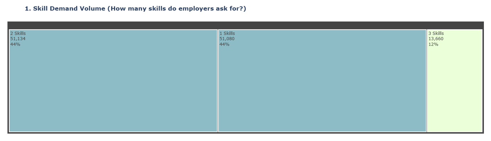

หากเจาะลึกไปที่เรื่อง Skill พบว่านายจ้างส่วนใหญ่ต้องการเพียง 1-2 Skills เท่านั้น ซึ่งมีสัดส่วนสูงถึงประมาณ 44% เท่ากันทั้งสองกลุ่ม ขณะที่งานที่ต้องการ 3 Skills มีเพียง 12% ดังนั้นภาพนี้สะท้อนว่าในตลาดงานจริง นายจ้างมักมองหา ทักษะหลักที่ตรงกับงาน ผู้สมัครไม่จำเป็นต้องมีหลายทักษะเสมอไป แต่หากมีทักษะที่ตรงกับตำแหน่ง 1–2 อย่างก็เพียงพอ

### Overall Skill Popularity (Lollipop Chart)

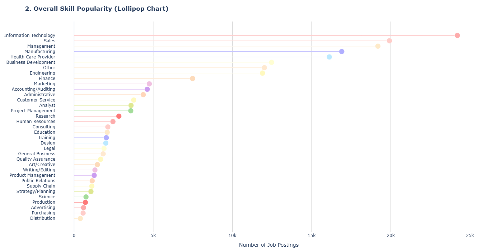

กราฟนี้แสดงความนิยมของ Skill ในตลาดงานทั้งหมด เพื่อให้เห็นว่าทักษะใดเป็นที่ต้องการสูงที่สุดในตลาดงาน จากผลลัพธ์จะเห็นว่ามี กลุ่มทักษะหลักบางกลุ่ม ถูกระบุในประกาศงานบ่อยมาก เช่น เช่น IT, Sales, Management หากผู้สมัครมีอย่างน้อย 1 ใน Top 10 Skills เหล่านี้ ก็มีแนวโน้มที่จะมีโอกาสสมัครงานได้ง่ายขึ้น

### Top 5 In-Demand Skills across Market Quadrants

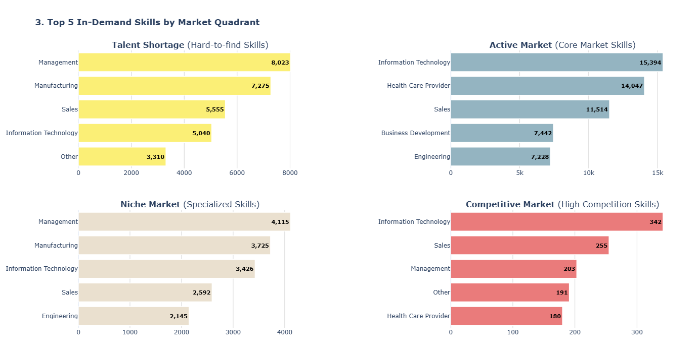

ในตลาดแรงงานแม้จะถูกแบ่งออกเป็น 4 Quadrants ตามลักษณะการสมัครและจำนวนโพสต์ แต่ Top 5 Skills ของแต่ละกลุ่มยังมีบางทักษะที่ปรากฏซ้ำกันอย่างชัดเจน โดยเฉพาะ IT ที่พบในทุกกลุ่มตลาด และ Management ที่พบในหลายกลุ่มเช่นกัน จึงชี้ให้เห็นว่าทักษะบางประเภทเป็น “core skill” ที่มีบทบาทครอบคลุมในตลาด

---

# Supply vs Demand: The Job Market Imbalance

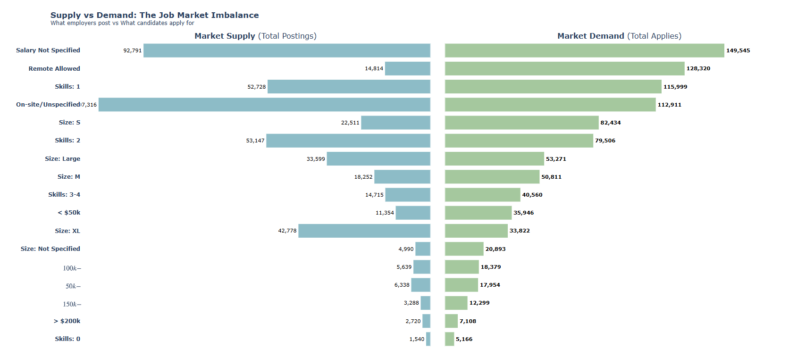

จากภาพรวมข้อมูลทั้งหมด เห็นได้ชัดว่าตลาดแรงงานมีความไม่สมดุลอยู่หลายมิติ โดยสรุปออกมาเป็น 4 ประเด็นสำคัญดังนี้

1) ฝั่งนายจ้าง (Supply) เปิดรับตำแหน่งแบบ Remote น้อยมาก (แค่ 14,814 โพสต์) แต่ฝั่งคนหางาน (Demand) กลับแห่ไปสมัครตำแหน่งนี้สูงถึง 128,320 ครั้ง เฉลี่ยผู้สมัครเกือบ 9 คนต่อ 1 โพสต์ บริษัทไหนที่เสนอเงื่อนไข Remote ได้ จะมีข้อได้เปรียบมหาศาลในการดึงดูด Talent ในขณะที่งาน On-site แม้จะมีตำแหน่งเปิดรับเยอะที่สุด (117,316) แต่ความสนใจของผู้สมัครกลับน้อยกว่าเมื่อเทียบกับสัดส่วนตำแหน่งที่เปิด
2) ลองสังเกตที่ขนาดบริษัทครับ บริษัทขนาดใหญ่มาก (Size: XL) มีการเปิดรับสมัครงานเยอะมาก (42,778) แต่กลับมียอดคนสมัครเพียง 33,822 ผู้สมัครอาจจะมองหาความยืดหยุ่น โอกาสเติบโตแบบก้าวกระโดด หรือวัฒนธรรมองค์กรแบบ Startup มากกว่าการเข้าไปอยู่ในองค์กรขนาดใหญ่
3) ** Salary Not Specified ** บริษัทส่วนใหญ่เลือกที่จะปกปิดฐานเงินเดือน ผู้สมัครจึงไม่มีทางเลือกนอกจากต้องกดสมัครไปก่อนเพื่อไปลุ้นเอาในด่านสัมภาษณ์ ข้อมูลส่วนนี้จึงเป็นเหมือน Noise ที่ก้อนใหญ่มากในตลาดแรงงาน
4) งานที่ต้องการทักษะแค่ 1 อย่าง มีคนสมัครถึง 115,999 ครั้ง แต่พอทักษะเพิ่มขึ้น ยอดผู้สมัครจะลดหลั่นลงมา สะท้อนผู้สมัครมีศักยภาพเพียงสกิลเฉพาะตัวเพื่อให้ตลาดคัดเลือกเข้าไปทำงาน

---

# Final Verdict: What Really Drives Job Applications?

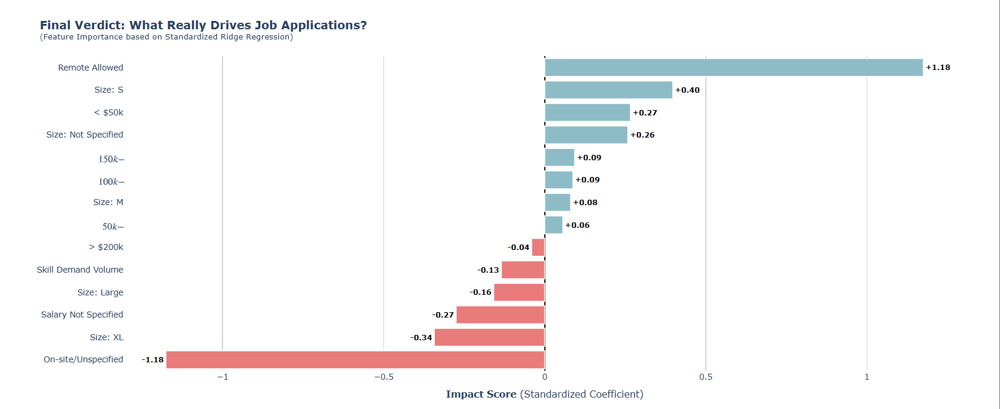

ผลกระทบจาก Ridge Regression จะว่าปัจจัยสามารถดึงดูดผู้สมัครอย่างชัดเจน และทางกลับกันก็สามารภ ลดแรงจูงใจในการสมัครได้ ซึ่งสามารถสรุปเป็น 4 ประเด็นหลักดังนี้

1) Remote Allowed ( +1.18 ) VS On-site/Unspecified ( −1.18 ) ยืนยันว่าผู้สมัครไม่ได้แค่มองหางาน แต่มองหา "รูปแบบการใช้ชีวิต" (Lifestyle)
2) Size: S ( +0.40 ) VS บริษัทขนาดใหญ่ Size: XL ( −0.34 ) VS Size: Large ( −0.16 ) ผู้สมัครอาจมองว่าองค์กรเล็กมีความยืดหยุ่นสูงกว่า คล่องตัวกว่า ไม่ได้ยึดติดความมั่นคง หรือเพราะบริษัทใหญ่ปัจจุบันเน้น layoff คนมากกว่าการ recruit แต่ต้องการให้โพสการสมัครงานยัง Active อยู่ ผู้สมัครจึงเบนความสนใจไปที่บริษัทขนาดเล็กกว่า แต่อาจให้ค่าตอบแทนสูงกว่า
3) < 50k( +0.27$) การที่ฐานเงินเดือนเริ่มต้นมี Impact เชิงบวก สะท้อนถึงสภาพตลาด Mass Market ซึ่งมีฐานผู้สมัคร เช่น เด็กจบใหม่ หรือคนที่กำลังหางานในระบบเป็นจำนวนมหาศาล เมื่อเทียบกับตำแหน่งระดับบริหาร
4) Skill Demand Volume ( −0.13 ) ยิ่ง List ต้องการทักษะเยอะมากเท่าไหร่ ยิ่งกลายเป็นกำแพงที่ผลักผู้สมัครออกไปมากขึ้นเท่านั้น

---

# Productivity & Trade-off Analysis

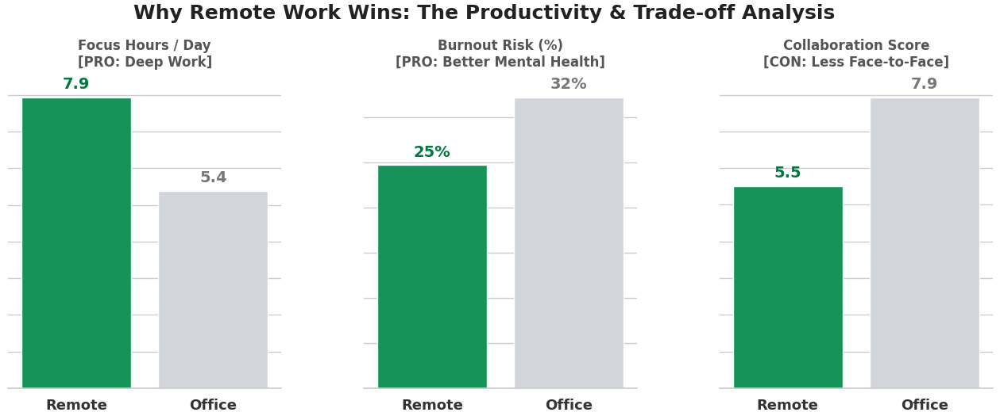

กราฟนี้สะท้อนว่า Remote Work มีข้อได้เปรียบชัดเจนในด้านประสิทธิภาพการทำงานส่วนบุคคล โดยผู้ทำงานแบบ Remote มี Focus Hours / Day สูงกว่า และมี Burnout Risk ต่ำกว่า เมื่อเทียบกับการทำงานแบบ Office จึงชี้ให้เห็นว่า ความยืดหยุ่นในการทำงานอาจช่วยให้พนักงานมีสมาธิกับงานได้มากขึ้น และลดความเหนื่อยล้าสะสมจากการทำงานได้ดีขึ้น
อย่างไรก็ตาม Office ยังคงมีจุดแข็งสำคัญในด้าน Collaboration ซึ่งมีคะแนนสูงกว่า Remote อย่างชัดเจน สะท้อนว่าการทำงานในออฟฟิศยังเอื้อต่อการสื่อสาร การประสานงาน และการทำงานร่วมกันในทีมได้ดีกว่า

โดยสรุป กราฟนี้ไม่ได้บอกว่า Remote ดีกว่า Office ในทุกมิติ แต่แสดงให้เห็นว่า Remote เหมาะกับงานที่ต้องใช้สมาธิและการทำงานเชิงลึก ขณะที่ Office เหมาะกับงานที่ต้องอาศัยการทำงานร่วมกันสูง มากกว่า

---

ท้ายที่สุดแล้ว ตลาดแรงงานไม่ได้ถามเพียงว่า <b>“ใครกำลังหางาน”</b> 
แต่กำลังถามกลับองค์กรด้วยว่า <b>“คุณเข้าใจคนทำงานมากพอแล้วหรือยัง”</b>

